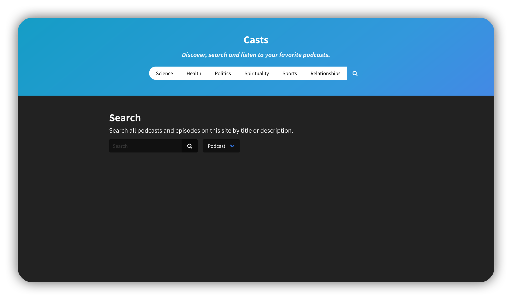
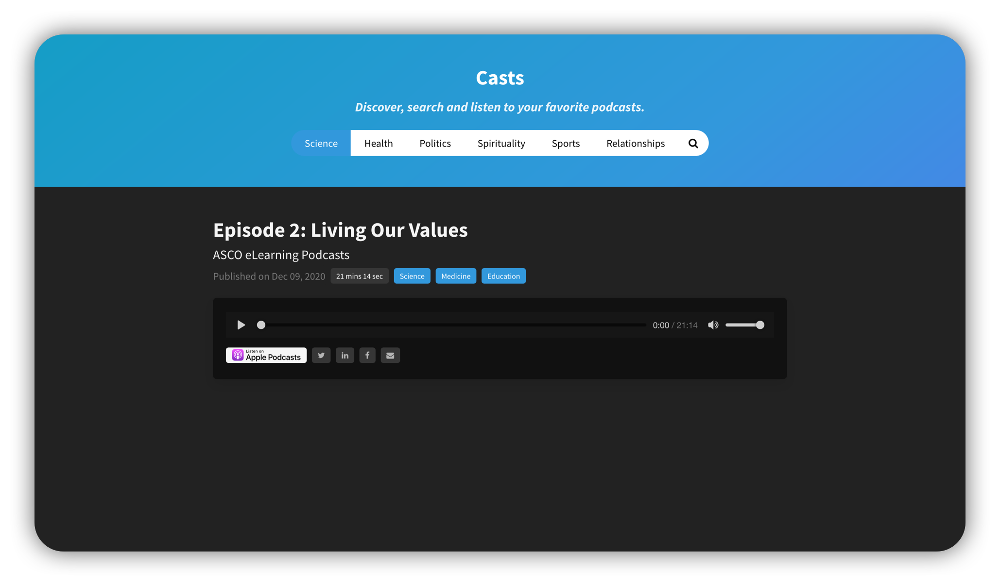

      
    

## Discover
Discover podcasts using the category tabs at the top of the page. Casts currently allows you to discover podcasts through 6 categories: "Science", "Health", "Politics", "Spirituality", "Sports" and "Relationships." More to come soon...

    

## Search (Coming soon..)
Search your favorites podcasts. Just curious? Use the search feature to discover new content and publishers.

    

## Listen
Listen to your favorite podcast anywhere in the world.

    

## TODO
- Build out search functionality
- Make user interface responsive

## Contributors
This project is maintained by the following people:

    

## License
[MIT License](./LICENSE.md)
